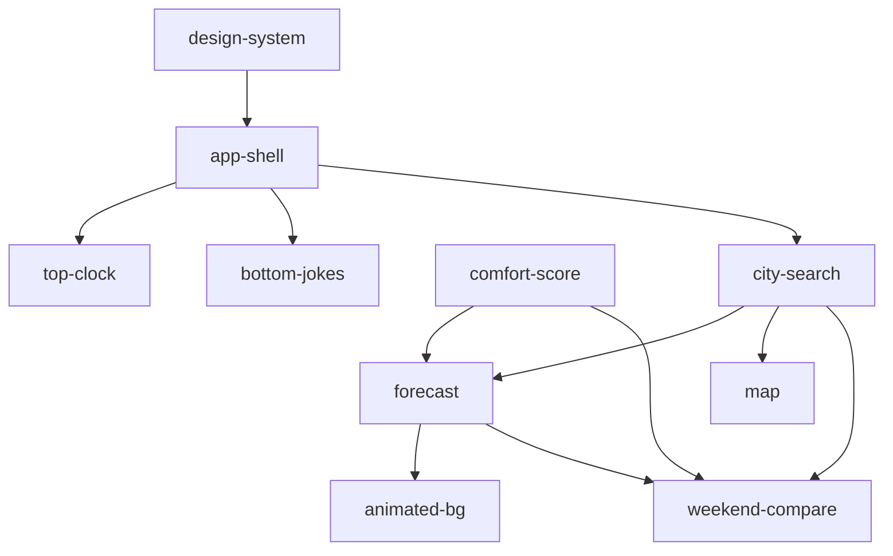

# Capability map & implementation order

Last updated: 2026-06-26

This document splits [`requirements.md`](requirements.md) into **capabilities** — one capability per `openspec new change <capability>` cycle — and
defines the **recommended build order** with dependencies.

The PRD remains the numbered source of truth (`FR-*`, `NFR-*`, `TC-*`,
`BC-*`). Each capability carries a delta spec under
`openspec/changes/<capability>/specs/<capability>/spec.md` and, after archive
+ sync, lands in `openspec/specs/<capability>/spec.md`.

---

## How capabilities map to OpenSpec

| Step | Action | Result |
| ---- | ------ | ------ |
| 1 | `openspec new change "<capability>"` | Scaffolded capability with proposal, design, tasks |
| 2 | Fill artifacts → `/opsx:apply` | Implementation against tasks |
| 3 | `/opsx:archive` + optional `/opsx:sync` | Delta merged into main capability spec |

**Naming rule:** capability names match the kebab-case slugs already used in the
PRD section headers (plus two foundation capabilities added for what the PRD
implies but does not name).

---

## Capability inventory

### Foundation (build first)

| Order | Capability | Primary requirements | Depends on |
| ----- | ---------- | -------------------- | ---------- |
| **0a** | `design-system` | BC-BRAND-01, TC-STACK-02, NFR-A11Y-02 | — |
| **0b** | `app-shell` | FR-SHELL-01, FR-SHELL-02, FR-SHELL-03, BC-BRAND-02, NFR-I18N-01 | `design-system` |

**0a — `design-system`** wires tokens, fonts, light/dark theme, and core
shadcn primitives. No feature logic. Reference: [`design.md`](../design.md).

**0b — `app-shell`** delivers the responsive page frame (top bar, main area,
empty-state hero), Ukrainian-first string plumbing (`lib/i18n/uk.ts`, `en.ts`),
theme indicator, and footer attribution links to Open-Meteo / OpenStreetMap.
Search and forecast slots are placeholders until later capabilities land.

### Independent UI slices (parallel after foundation)

| Order | Capability | Primary requirements | Depends on |
| ----- | ---------- | -------------------- | ---------- |
| **1a** | `top-clock` | FR-CLOCK-01 | `app-shell` |
| **1b** | `bottom-jokes` | FR-JOKES-01 | `app-shell` |

Both are demo-friendly, self-contained header/footer additions. Neither blocks
the core trip-planning loop.

### Domain core (the MVP loop)

| Order | Capability | Primary requirements | Depends on |
| ----- | ---------- | -------------------- | ---------- |
| **2** | `comfort-score` | FR-COMFORT-01, FR-COMFORT-02, FR-COMFORT-03, TC-PURE-01 | — (pure `lib/` only) |
| **3** | `city-search` | FR-SEARCH-01 … FR-SEARCH-05, BC-PRIVACY-02, TC-DATA-01, TC-STACK-03 | `app-shell` |
| **4** | `forecast` | FR-FORECAST-01 … FR-FORECAST-05, FR-COMFORT-04, FR-COMFORT-05, TC-STACK-03, TC-DATA-01 | `city-search`, `comfort-score`, `app-shell` |

**Why `comfort-score` before `forecast`:** scoring is a pure function in
`lib/scoring/comfort.ts` with Vitest coverage. Ship and test it before UI
badges (FR-COMFORT-04) and the weekend highlight (FR-COMFORT-05).

**Why `city-search` before `forecast`:** forecast needs an active location
(`?lat=&lon=&name=`) and re-fetch on location change (FR-FORECAST-05).

### Enrichment (same location model)

| Order | Capability | Primary requirements | Depends on |
| ----- | ---------- | -------------------- | ---------- |
| **5** | `map` | FR-MAP-01 … FR-MAP-05, TC-STACK-04, TC-MAP-01 | `city-search`, `app-shell` |
| **6** | `animated-bg` | FR-ANIM-01 … FR-ANIM-04 | `forecast` (sunrise/sunset + conditions) |
| **7** | `weekend-compare` | FR-COMPARE-01 … FR-COMPARE-03 | `city-search`, `forecast`, `comfort-score` |

**Why `map` after `city-search`:** shared active-location state; map click
reverse-geocodes and re-triggers search + forecast (FR-MAP-03).

**Why `animated-bg` after `forecast`:** day/night and particles need today's
sunrise/sunset and condition data for the active place (FR-ANIM-01/02).

**Why `weekend-compare` last:** pins up to three cities and compares Sat/Sun
comfort — needs search, forecast fetch, and scoring for each pin.

---

## Recommended implementation sequence

```text
Phase 0 — Foundation
  design-system → app-shell

Phase 1 — Shell polish (can overlap)
  top-clock ∥ bottom-jokes

Phase 2 — Core loop
  comfort-score → city-search → forecast

Phase 3 — Full experience
  map → animated-bg → weekend-compare
```



### Milestone checkpoints

| After capability | Demoable outcome | Key requirement IDs |
| ---------------- | ---------------- | ------------------- |
| `app-shell` | Responsive empty hero, theme toggle, footer credits | FR-SHELL-*, BC-BRAND-02 |
| `city-search` | Type city → URL updates → shareable link | FR-SEARCH-* |
| `forecast` | 7-day cards + 48 h chart + weekend highlight | FR-FORECAST-*, FR-COMFORT-04/05 |
| `map` | Click map → location + forecast refresh | FR-MAP-* |
| `animated-bg` | Sky reflects place + reduced-motion fallback | FR-ANIM-* |
| `weekend-compare` | Pin 3 cities, toggle compare table | FR-COMPARE-* |

---

## Cross-cutting requirements (every capability)

These are **not** separate capabilities. Each capability's design and tasks
must explicitly satisfy the rows that apply.

### Non-functional

| ID | Applies from | Notes |
| -- | ------------ | ----- |
| NFR-PERF-01 | `app-shell` onward | Measure on Vercel Preview after deploy wiring |
| NFR-PERF-02 | `forecast` onward | Lighthouse ≥ 90 once main content exists |
| NFR-PERF-03 | all UI changes | Keep client JS ≤ 200 KB gz; map/chart are heavy — lazy-load |
| NFR-A11Y-01 | `design-system` onward | Focus rings, accessible names on every interactive control |
| NFR-A11Y-02 | `design-system` | WCAG AA in both themes |
| NFR-COST-01 | all | Open-Meteo + OSM only; no paid keys |
| NFR-OBS-01 | all | Silent console on healthy session |
| NFR-DX-01 | Phase 0 | `lint`, `tsc`, `test`, `build` < 60 s — set up in foundation |
| NFR-I18N-01 | `app-shell` | Centralise strings; no runtime i18n library |

### Technical constraints

| ID | Primary capability | Notes |
| -- | ---------------- | ----- |
| TC-STACK-01 | `app-shell` | Next.js 16 App Router, TS strict, React 19 |
| TC-STACK-02 | `design-system` | Tailwind 4, shadcn base-nova |
| TC-STACK-03 | `city-search`, `forecast` | Open-Meteo forecast + geocoding |
| TC-STACK-04 | `map` | Leaflet + react-leaflet, OSM raster |
| TC-STACK-05 | `comfort-score` + each `lib/` module | Vitest on `lib/` |
| TC-DEPLOY-01 | `app-shell` | Vercel preview per PR |
| TC-DATA-01 | `city-search`, `forecast` | Server Components / Route Handlers for API calls |
| TC-MAP-01 | `map` | OSM attribution + tile policy |
| TC-PURE-01 | `comfort-score` | No `next/*`, `react`, or DOM in `lib/` |

### Business / UX

| ID | Primary capability | Notes |
| -- | ---------------- | ----- |
| BC-PRIVACY-01 | all | No analytics or trackers |
| BC-PRIVACY-02 | `city-search` | Geolocation only on explicit button — **not** on load |
| BC-PRIVACY-03 | all | No application cookies |
| BC-BRAND-01 | `design-system` | Calm Ukrainian-first tone; no exclamation marks |
| BC-BRAND-02 | `app-shell` | Footer credits with links |
| BC-DEMO-01 | all | Every shipped capability is demoable on the live URL |

---

## Requirement → capability traceability

### Functional requirements

| Requirement | Capability |
| ----------- | ---------- |
| FR-SHELL-01 | `app-shell` |
| FR-SHELL-02 | `app-shell` |
| FR-SHELL-03 | `app-shell` |
| FR-CLOCK-01 | `top-clock` |
| FR-SEARCH-01 | `city-search` |
| FR-SEARCH-02 | `city-search` |
| FR-SEARCH-03 | `city-search` |
| FR-SEARCH-04 | `city-search` |
| FR-SEARCH-05 | `city-search` |
| FR-JOKES-01 | `bottom-jokes` |
| FR-FORECAST-01 | `forecast` |
| FR-FORECAST-02 | `forecast` |
| FR-FORECAST-03 | `forecast` |
| FR-FORECAST-04 | `forecast` |
| FR-FORECAST-05 | `forecast` |
| FR-MAP-01 | `map` |
| FR-MAP-02 | `map` |
| FR-MAP-03 | `map` |
| FR-MAP-04 | `map` |
| FR-MAP-05 | `map` |
| FR-COMFORT-01 | `comfort-score` |
| FR-COMFORT-02 | `comfort-score` |
| FR-COMFORT-03 | `comfort-score` |
| FR-COMFORT-04 | `forecast` (UI consumes `comfort-score`) |
| FR-COMFORT-05 | `forecast` (UI consumes `comfort-score`) |
| FR-ANIM-01 | `animated-bg` |
| FR-ANIM-02 | `animated-bg` |
| FR-ANIM-03 | `animated-bg` |
| FR-ANIM-04 | `animated-bg` |
| FR-COMPARE-01 | `weekend-compare` |
| FR-COMPARE-02 | `weekend-compare` |
| FR-COMPARE-03 | `weekend-compare` |

### Out of scope (no capability)

Per PRD — do not create capabilities for: push notifications, accounts, server-side
favorites, marine/aviation variables, locales beyond UA+EN, native app, or
historical climate analysis.

---

## OpenSpec command cheat sheet

Run capabilities **in order** (respect dependencies). Example for the first
capability:

```bash
openspec new change "design-system"
# → fill proposal, design, tasks via /opsx:propose or manually
# → implement via /opsx:apply
# → archive via /opsx:archive and sync specs
```

Suggested capability queue:

1. `design-system`
2. `app-shell`
3. `top-clock` · `bottom-jokes` (either order)
4. `comfort-score`
5. `city-search`
6. `forecast`
7. `map`
8. `animated-bg`
9. `weekend-compare`

---

## Notes & gaps

| Topic | Detail |
| ----- | ------ |
| **FR-SEARCH-06** | Product brief mentions a "Use my location" button; it is **not** in `requirements.md`. Add to `city-search` delta spec during propose, or amend the PRD first. |
| **`weekend-compare`** | PRD header marks it optional; product brief promotes it to MVP at Checkpoint 1. Treat as **Phase 3, last** — not optional for the workshop demo. |
| **E2E** | TC-STACK-05 defers Playwright; verify flows with `chrome-devtools` MCP recordings per capability. |
| **Parallel work** | After `app-shell`, `top-clock`, `bottom-jokes`, and `comfort-score` can proceed in parallel if different agents own them. |

---

## Related docs

- [`requirements.md`](requirements.md) — numbered requirements (source of truth)
- [`product-brief.md`](product-brief.md) — user journeys and MVP boundary
- [`design.md`](../design.md) — design system integration contract
- [`current-state.md`](current-state.md) — session handoff / what shipped last
